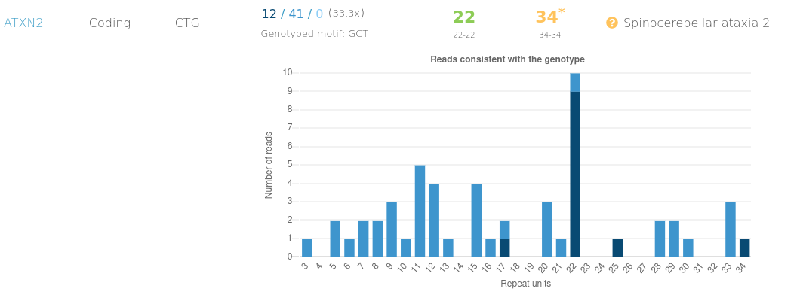
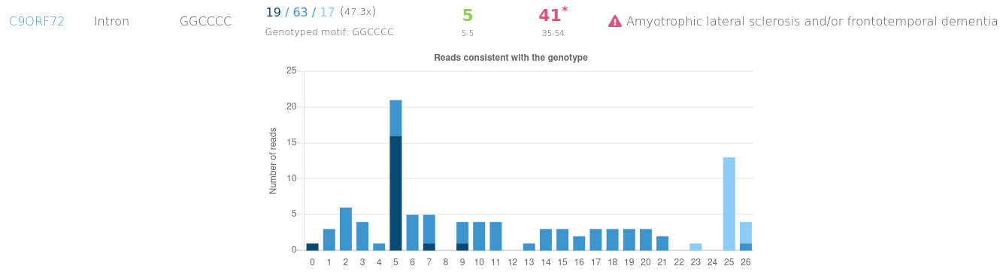

DSI-Africa: First Human Genome Repeat Expansions Analysis Virtual Workshop
May 8-21, 2024

Stream 1 (Groups 4)

Project Title: Identification of pathogenic disease-associated short tandem repeats (STRs) in clinical samples

## Tools

The analysis for this project employed [ExpansionHunter](https://github.com/Illumina/ExpansionHunter), [REViewer](https://github.com/Illumina/REViewer) and [STRipy Database Pipeline](https://gitlab.com/andreassh/stripy-pipeline) to call and annotate Short Tandem Repeats (STRs).

**ExpansionHunter** was used to identify Short Tandem Repeats (STR), **REViewer** to visualise the alignment of the STR and the **STRIpy pipeline** to compare the identified STRs to the STRIpy Database to see the effect of the STRs on the associated diseases.

## Major Results

Fig 1. Read depth for sample ERR1955504 with  STR expansion in the intermediate range for ATXN2 gene. This gene is implicated in  Spinocerebellar ataxia 2

Fig 2. Read depth for sample ERR1955473 with  STR expansion in the pathogenic range for C90RF72 gene. This gene is implicated in Amyotrophic lateral sclerosis and/or frontotemporal dementia

## Contributors

James Osei-Mensa (oseimensa@kccr.de, oseimensa@outlook.com)
