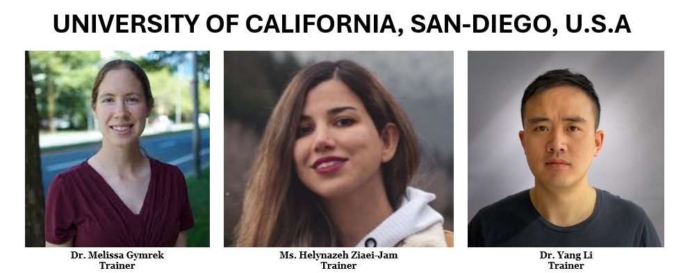

# DSI-Africa: First Human Genome Repeat Expansions Analysis Virtual Workshop

Four Universities, Covenant University, Makerere University, the University of Cape Town (UCT), and the University of California, San Diego (UCSD) are collaborating to present a two-week virtual workshop on repeat expansion detection and complex phenotypes association in Africa. This workshop is funded by the R01 DS-I Africa award number 1U01HG013442-01 and you can find more information about it at https://h3africa.org/index.php/2022/09/14/h3africa-cross-consortium-genome-analysis-of-repeat-expansions-in-wgs-data-project-spotlight/ and https://dsi-africa.org/project/28

## Training Team

## Course Overview
### Workshop Timetable
|**Module**|**Day**|**Lecture/Practical 1 (1 Hour)**|**Break (30 Mins)**|**Lecture/Practical 2 (1 Hour)**|**Research Talks (15 Mins)**|
|:---:|:---:|:---:|:---:|:---:|:---:|
Module 1 | 1 Wed | A brief review of NGS and its technologies (L) - Ms Faith Adegoke | | Genotyping, genetic variation and its types, resources, and databases for NGS (L) - Prof. Jelili Oyelade |General Introductions of Training Team and Participants
| | 2 Thurs | Bash/shell scripting, working in a batch environment, job submission on HPC, installing software and tools using the command line (L) - Dr. Marion Adebiyi & Ms. Faith Adegoke | | NGS file format, NGS analysis tools  (P) - Dr. Marion Adebiyi & Ms. Faith Adegoke | Ms. Nomakhosazana Monnakgotla Research Talk|
Module 2| 3 Fri | Description of tandem repeats, types of TR, and their characteristics (L) - Dr. Daudi Jjingo & Mr. Walter Odur | | The role of repeat expansions in neurological diseases (L) - Prof. Melissa Nel | Divide participants into Groups|
| | 4 Mon | Short TR, STR genotyping (L) - Prof. Melissa Gymrek | | Tools for identifying STRs: strengths and weaknesses (P) - Mr. Ibra Lujumba | Brief description of the projects |
Module 3 | 5 Tues | Introduction to ExpansionHunter (L) - Ms. Helyaneh Ziaei-jam | | Installing and running ExpansionHunter (P) - Ms. Helyaneh Ziaei-jam | Jumoke Adeyemi, Walter Odur Talk|
| | 6 Wed | Introduction to HipSTR and TRTools  (L) - Ms. Helyaneh Ziaei-jam | | Installing and using HipSTR/TRTools  (P) - Ms. Helyaneh Ziaei-jam | | 
| | 7 Thurs | Association Analysis (L) | | Association Analysis (P)| | 
Module 4| 8 Fri | Projects team meeting | | Projects team meeting| | 
| | 9 Mon | Presentation of project outcomes | | Presentation of project outcomes| |
| | 10 Tues | Announcement of hackathon results | | Feedbacks + Closing | |

## Project Description
### A detailed description of the projects can be found here:
+ **Project 1 (For Groups 1 - 4)**
    + [Project 1 Instruction](Projects_Description/Project1-Instruction.md)
      
    + [Project 1 Setup](Projects_Description/Project1-Setup.md)
       
+ **Project 2 (For Groups 5 - 8)**
    + [Project 2 Instruction](Projects_Description/Project2-Instruction.md)
      
    + [Project 2 Setup](Projects_Description/Project2-Setup.md)

## Projects Results Submission by Participants
All participants were grouped into 8 groups and were given projects to carry out. A group member pushed the results for each group to their respective folders on the GitHub repository. Each group's result can be found in these folders:

+ [Group 2](https://github.com/ItunuIsewon/repeatsanalysis_2024/tree/main/Group_2)
+ [Group 6](https://github.com/ItunuIsewon/repeatsanalysis_2024/tree/main/Group_6)
+ [Group 8](https://github.com/ItunuIsewon/repeatsanalysis_2024/tree/main/Group_8)

